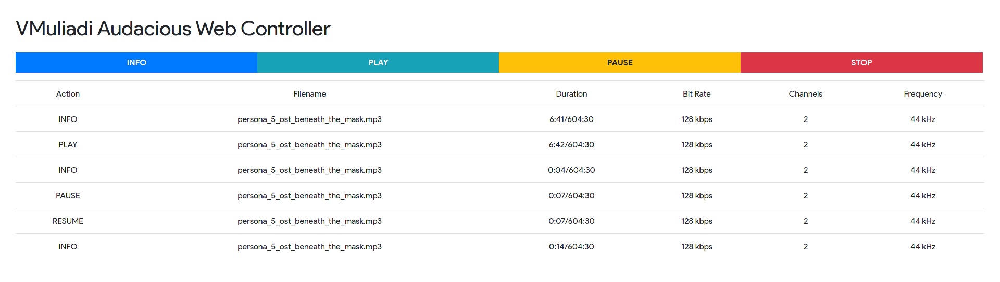

# Audacious Web Controller
Audacious is the best music player that I know so far.
It blessed with headless player and it's very light.
But when came into Raspberry Pi with console, you need to SSH to the console and execute the command to play/stop/pause/resume the playlist.
This web controller will help you to stop/play/pause/resume song using REST API. 



# TODO
- Add play audio files from browser (load audio file in a directory)
- Migrate HTML to Jinja 2 Templating Engine

# Tech Stack
Backend: Python flask<br />
Frontend: Bootstrap 4 and jQuery

# How to Use
```
sudo cp index.html /var/www/html
export FLASK_APP=main.py
flask run
```
